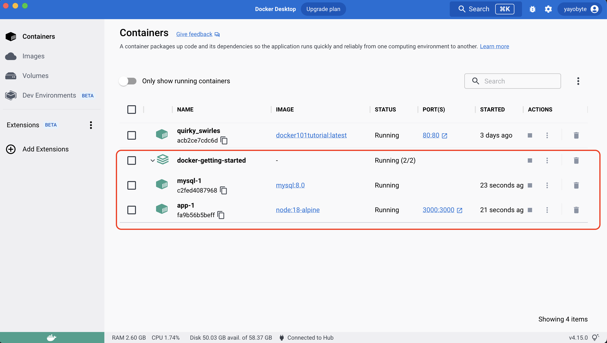

# GETTING STARTED WITH DOCKER
This repo was generated to start in the `docker` world. Just for learning purposes.
All these docs have been taken from

> docker `run` -d -p 80:80 docker/getting-started

## Prerequisites
- docker installation
- docker desktop
- docker hub account

## Apps
- `webapp` created in react and will use its own container
- `mysql` server in an isolated container

# Contents
## Creating the container
First we have to create a `Dockerfile` in our repo. Make sure you do not use any extension

    FROM node:18-alpine 
    WORKDIR /app
    COPY . .
    RUN yarn install --production
    CMD ["node", "src/index.js"]

> `FROM` which image to use\
> `WORKDIR` which dir will now be used as root from now on inside the container\
> `COPY` from which directory in the code to which `WORKDIR` in the container\
> `RUN` which command to run after previous step\
> `CMD` specifies the instruction that is to be executed when a Docker container starts.

## Building the image
Taking a look at the `Dockerfile` that is the command used to build the image and then run:
> `tag-name` is the name of the app\
> `.` (at the end) as parameter will tell docker to use Dockerfile in the root of the folder\
> \
> docker `build` -t *getting-started* .

## Starting a Container
Now that we have an image, we should start the container
> docker `run` -dp 3000:3000 *getting-started*

After a few seconds you will see the webapp running in
> http://localhost:3000

### Implementing changes
You can do any change in the app, and then you can deploy again
**make sure you stop and remove the container first!**

1. Let's list all the containers and to get the `container-id`
> docker `ps`
2. Stop the running container
> docker `stop` *container-id*
3. Remove the container
> docker `rm` *container-id*
4. Build the container again (make sure to use tags to identify your container)
> docker `build` -t *getting-started*
5. Run the container again with the new changes
> docker `run` -dp 3000:3000 *getting-started*\

> `-d` will run in detached mode\
> `-p` port forwarding option (short version)

## DockerHub
You can share your app using dockerhub. If you are new to DockerHub, it is something similar to GitHub but with docker containers :)

1. Login to DockerHub
> docker `login` -u YOUR-USER-NAME
2. Use a tag to identify your container
> docker `tag` *tag-name* YOUR-USER-NAME/tag-name
3. Push your changes
> docker `push` YOUR-USER-NAME/tag-name

## Play with docker
You can test your container online with https://labs.play-with-docker.com and run the image using the command docker `run`

> docker `run` -dp 3000:3000 *YOUR-USER-NAME/getting-started*

**note**: Make sure you use the DockerHub `YOUR-USER-NAME/tag-name` and not the local `tag-name` as this will pull the image from `DockerHub`

## Volumes
If you want to persist the data, you should use **volumes**. Think of volumes as a simple bucket of data
1. Create a volume
> docker `volume` create *todo-db*
2. Run the container but binding the **volume** to the route you want to persist the data to
> docker `run` -dp 3000:3000 -v *todo-db:/app* **getting-started**

> `-v` option will use the previously created volume and will use the **/app** path to make the data persist
3. Use the volume inspect command if you want to know more about the volume
> docker `volume` inspect *todo-db*

## Dev Mode Container
To run the container in dev mode `hot reloading` to have the changes in your code base reflected inside the container:
Run the following command

    docker run -dp 3000:3000
    -w /app -v "$(pwd):/app"
    node:18-alpine
    sh -c "yarn install && yarn run dev"

> `-dp 3000:3000` same as before port forwarding\
> `-w /app` working directory *inside* the container\
> `-v "$(pwd):/app"` *bind mount* (link) the **host** present dir with the **containers** route dir `/app` but docker requires absolute path, for that we use `psd` instruction\
> `node:18-alpine` image to use\
> `sh -c` initial command to run

2. if you want to see the logs, use the instruction:
> docker `logs` -f *container-id*
3. Do any kind of changes in the code, and you will see them reflected

## Multi-container Apps
Usually an app is build using different services, and to achieve that you can deploy multiple containers each one with one single responsibility but connected by one *internal* `network`
### Networks
If two containers are on the same network, they can talk to each other. If they aren't, they can't.

Let's create a new network
> docker `network` create *todo-app*

For this example, we will create a MySQL container to have db functionality in the app

    docker run -d \
    --network todo-app --network-alias mysql \
    -v todo-mysql-data:/var/lib/mysql \
    -e MYSQL_ROOT_PASSWORD=secret \
    -e MYSQL_DATABASE=todos \
    mysql:8.0

> `--network` **todo-app** will be the network we created before\
> `--network-alias` adds network-scoped alias for the container, in this case: **mysql** (works as the host name/IP address)\
> `-v` will create a volume **todo-mysql-data** and will be linked to the path **/var/lib/mysql** which is the place where *mysql* stores the data\
> `-e` set environment var\
> `mysql:8.0` image to use

Now we can run our app in `development mode` connecting it to the previous MYSQL server and passing the required `env vars` to connect to db and telling docker which `network` to use

    docker run -dp 3000:3000 \
    -w /app -v "$(pwd):/app" \
    --network todo-app \
    -e MYSQL_HOST=mysql \
    -e MYSQL_USER=root \
    -e MYSQL_PASSWORD=secret \
    -e MYSQL_DB=todos \
    node:18-alpine \
    sh -c "yarn install && yarn run dev"

Now both of the containers are connected in the same network and the data is being persisted

## Docker Compose
Is a tool to help develop, define and share `Multi-container` apps with a single file `docker-compose.yml` the file always starts with the `services` tag and the next level will be the app name (it can be what ever name, but it will become a `--network-alias`)
    
    services:
        app: //we will define the web app here 
        mysql: //we will define the mysql server here

Let's now migrate our previous scripts into the `docker-compose.yml` file:

1. WebApp

As previously defined this into one script we will transpile the script into `docker compose` config:

    services:
        app:
            image: node:18-alpine
            command: sh -c "yarn install && yarn run dev"
            ports:
                - 3000:3000
            working_dir: /app
            volumes:
                - ./:/app
            environment:
                MYSQL_HOST: mysql
                MYSQL_USER: root
                MYSQL_PASSWORD: secret
                MYSQL_DB: todos

> `app` name of the service, it will be used as **--network-alias**
> `image` name of the image to use\
> `ports` port forwarding short syntax ([long syntax here](https://docs.docker.com/compose/compose-file/#long-syntax-2)) \
> `working_dir` working dir inside the container\
> `volumes` short syntax for volumes *VOLUME:CONTAINER_PATH* ([long syntax here](https://docs.docker.com/compose/compose-file/#long-syntax-4))\
> `environment` list of all the env vars needed

2. MYSQL service

Now let's migrate the MYSQL command to the yml configuration

    services:
        app:
            # The previous app service definition
        mysql:
            image: mysql:8.0
            volumes:
                - todo-mysql-data:/var/lib/mysql
            environment:
                MYSQL_ROOT_PASSWORD: secret
                MYSQL_DATABASE: todos
    
    volumes:
        todo-mysql-data:

> `mysql` name of the service, it will be used as **--network-alias**\
> `image` image to use
> `volumes` short syntax *VOLUME:CONTAINER_PATH*\
> `environment` env vars\
> `volumes` (root level) config new volumes to be created\
> `todo-mysql-data` name of the new volume to be used

3. Put all together in one `docker-compose.yml` file and run the command

> docker `compose` up

Now the whole app including the web service and the db service are running into one single container and this will look something similar to this:

Once you are ready, simply run

> docker `compose` down

## Other useful commands
> docker `exec` *container-id*  command

> docker `logs` -f *container-id*

## Useful containers
> docker `exec` -it <mysql-container-id> mysql -p

> docker `run` -it --network todo-app nicolaka/netshoot

# Resources
> https://www.dockerhub.com

> https://labs.play-with-docker.com

> `//Official docs from docker getting started`\
> docker `run` -d -p 80:80 docker/getting-started

